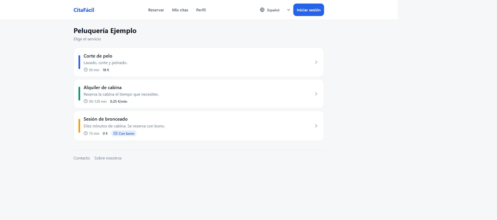
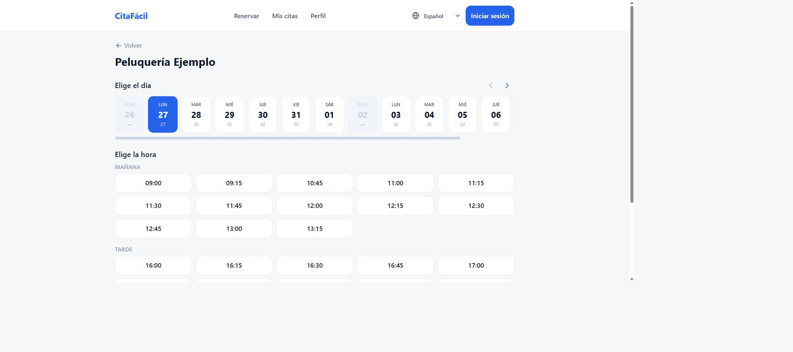
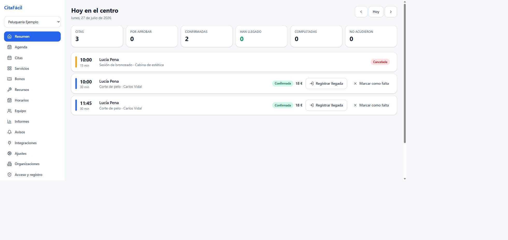

# CitaFácil

Plataforma de gestión de citas online para cualquier tipo de establecimiento:
peluquerías, clínicas, gimnasios, piscinas, pistas deportivas, talleres,
administraciones. El modelo de datos es genérico a propósito: un *servicio* que
consume un *recurso* durante un rato, con su horario, su aforo y sus reglas.

- **Backend** en Node con Fastify y TypeScript.
- **Frontend** en React, pensado primero para móvil, servido por el mismo
  proceso y el mismo puerto que el API (se puede separar cambiando una variable).
- **Base de datos** SQLite por defecto, sin instalar nada, con soporte para
  PostgreSQL, MySQL, MariaDB y SQL Server cambiando una variable de entorno.
- **Sin dependencias de infraestructura**: no hace falta cola externa ni caché.
  Un contenedor y un volumen bastan. Redis es opcional y solo aporta cupo
  compartido del limitador y caché de sesión cuando hay varias instancias.

## Cómo se ve

La página pública de reservas, pensada primero para el móvil:



Elegir día y hora, con los huecos que quedan libres en cada jornada:



El panel del establecimiento, con el día de un vistazo:



Hay más capturas en [docs/capturas](docs/capturas).

## Puesta en marcha en un minuto

```bash
cp .env.example .env
npm install
npm run build
npm run seed      # datos de ejemplo (opcional)
npm start
```

Abre <http://localhost:3000>. Con los datos de ejemplo puedes entrar con
`admin@ejemplo.es` y la contraseña `CitaFacil2026!`.

Para crear tu propio administrador de la instalación:

```bash
npm run admin -- tu-correo@ejemplo.es "una-contraseña-larga"
```

Con Docker:

```bash
cp .env.example .env      # define APP_SECRET
docker compose up -d
```

## Qué incluye

### Reservas

- Servicios de **duración fija** o **ajustable por el cliente**: el
  administrador activa el modo flexible y define mínimo, máximo y tramo, y quien
  reserva elige cuánto tiempo quiere estar. El precio puede ir por minuto.
- Recursos de cualquier tipo (personal, salas, pistas, calles de piscina,
  equipos) con **aforo** propio, para clases y espacios compartidos.
- Horarios semanales por sede, por recurso o por servicio, con festivos,
  aperturas extraordinarias y ausencias.
- Márgenes de preparación antes y después de cada cita.
- Reglas por servicio: antelación mínima y máxima, plazos para cancelar y
  cambiar de fecha, aprobación manual, señal o pago previo.
- **Bloqueo temporal del hueco** mientras el cliente completa la reserva, para
  que dos personas no acaben con la misma hora.
- **Lista de espera** con aviso automático cuando se libera un hueco.
- **Citas periódicas** (cada N semanas, en los días que se indiquen).
- Reserva sin cuenta si el establecimiento lo permite.
- Asignación automática de recurso con estrategias distintas, incluida una que
  minimiza los huecos muertos de la agenda.

### Acceso e identidad

- **DNI electrónico y certificado FNMT** mediante TLS mutuo, con validación de
  cadena contra las CA configuradas, control de vigencia y comprobación de
  revocación por CRL.
- **Google**, **Cl@ve** y cualquier otro proveedor **OpenID Connect**.
- **Passkeys** (WebAuthn) y usuario con contraseña.
- El administrador decide **qué métodos de acceso están activos** y **quién
  puede darse de alta**: registro abierto, solo personas autorizadas
  (identificadas por correo, por dominio o por DNI), solo por invitación, o
  cerrado. También puede crear cuentas y enviar un enlace para que cada persona
  elija su contraseña.
- **Segundo factor**: aplicación de autenticación (Google Authenticator,
  Microsoft Authenticator, Authy), código por correo, passkey y códigos de
  recuperación.
- Roles y permisos por organización, claves de API con permisos acotados y
  registro de auditoría.

### Avisos

- Correo, notificaciones push (Firebase y Web Push), Telegram, WhatsApp y SMS.
- **Recordatorios configurables**: un día antes, una hora antes o cualquier
  antelación a medida, definida por la organización y ajustable por cada usuario.
- Resguardo de cita en PDF con código QR, y fichero de calendario `.ics`.
- Plantillas editables por evento, canal e idioma.

### Control de acceso físico

Un endpoint pensado para tornos, puertas y lectores: se le presenta el código
del QR, el DNI o el identificador de la cita y responde si se permite el paso.
Ver [docs/control-de-acceso.md](docs/control-de-acceso.md).

### Integraciones

- **Servidor MCP** para asistentes de IA: pueden consultar disponibilidad,
  reservar y cancelar en nombre del usuario.
- **Alexa** (con verificación de firma) y **Google** (webhook de Dialogflow).
- Webhooks salientes firmados con HMAC.
- Pagos con **Stripe** y **Redsys**.

### Administración

Panel con el día a día del establecimiento, agenda por recurso, gestión de
citas, servicios, bonos, recursos, horarios, equipo, informes de ocupación e
ingresos, plantillas de aviso, integraciones, ajustes y copias de seguridad.

## Documentación

| Documento | Contenido |
| --- | --- |
| [Instalación](docs/instalacion.md) | Requisitos, arranque local y con Docker |
| [Configuración](docs/configuracion.md) | Todas las variables de entorno |
| [Arquitectura](docs/arquitectura.md) | Cómo está montado y por qué |
| [Organizaciones](docs/organizaciones.md) | Varios negocios, páginas de contacto y sobre nosotros |
| [Base de datos](docs/base-de-datos.md) | Esquema, motores y migraciones |
| [Autenticación](docs/autenticacion.md) | DNIe, FNMT, Cl@ve, passkeys y 2FA |
| [API](docs/api.md) | Endpoints, autenticación y errores |
| [Reglas de reserva](docs/reglas-de-reserva.md) | Cobro del bono, plazos y programaciones semanales |
| [Clientes](docs/clientes.md) | Ficha de cliente: historial, gasto, faltas, notas y etiquetas |
| [Formularios](docs/formularios.md) | Preguntas previas y consentimientos firmados |
| [Turnos](docs/turnos.md) | Cola sin cita previa, avisos y pantalla de sala |
| [Informes](docs/informes.md) | Comparativas, comisiones y exportación a CSV |
| [Valoraciones](docs/valoraciones.md) | Moderación, respuesta del negocio y publicación en la página |
| [Bonos](docs/bonos.md) | Sesiones prepagadas, venta online y servicios que las exigen |
| [Temas y aspecto](docs/temas.md) | Colores, tipografía, CSS propio y marca de la cabecera |
| [Imágenes e iconos](docs/imagenes.md) | Logotipos, iconos e iniciales de cada entidad |
| [Notificaciones](docs/notificaciones.md) | Canales, plantillas y recordatorios |
| [Control de acceso](docs/control-de-acceso.md) | Integración con puertas y tornos |
| [Integraciones](docs/integraciones.md) | MCP, Alexa, Google, webhooks y pagos |
| [Copias de seguridad](docs/backups.md) | Automatización y restauración |
| [Despliegue](docs/despliegue.md) | Producción, proxy y escalado |
| [Desarrollo](docs/desarrollo.md) | Estructura del código y pruebas |

## Estructura del repositorio

```
packages/
  shared/   Tipos, enumerados, esquemas de validación y utilidades comunes
  api/      Backend Fastify: dominio, datos, integraciones y tareas
  web/      Frontend React
docker/     Configuración de nginx para TLS mutuo
docs/       Documentación
```

## Licencia

Software propietario. Copyright (c) 2026 Mateo Fuentes Pombo. Todos los derechos reservados.

| | |
| --- | --- |
| Instalarlo y usarlo **sin ánimo de lucro** | Sí |
| Leer y estudiar el código | Sí |
| Copiarlo para instalarlo, ejecutarlo y respaldarlo | Sí |
| Uso comercial o lucrativo | No |
| Modificarlo o crear obras derivadas | No |
| Copiarlo o distribuirlo más allá de lo anterior | No |
| Ingeniería inversa | No |
| Retirar los avisos de autoría | No |

Para cualquiera de los usos no permitidos hace falta autorización escrita del
titular: escribe a mateof@gmail.com describiendo el uso previsto.

Los términos completos están en [LICENSE](LICENSE), en castellano y con
traducción al inglés. Las bibliotecas de terceros que usa el proyecto mantienen
sus propias licencias.
