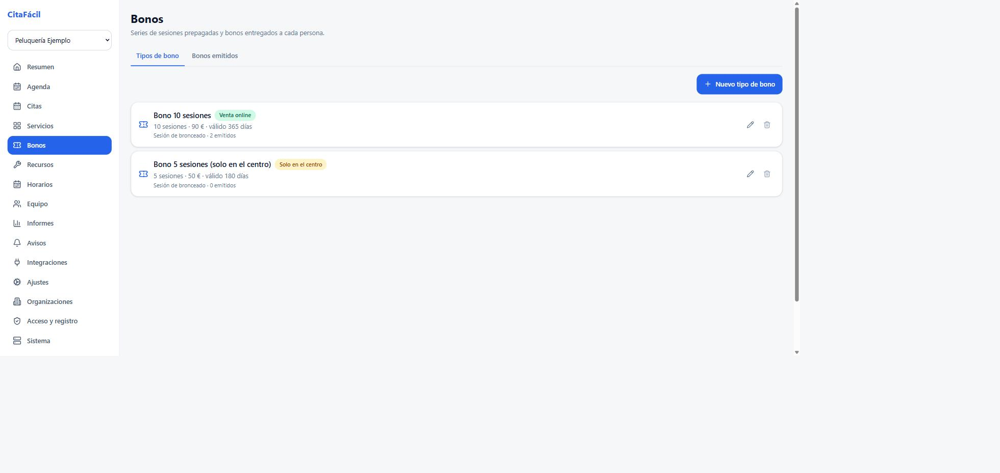
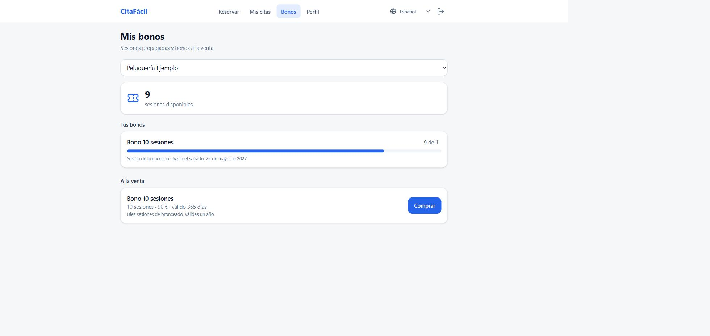

# Bonos

Un bono es una serie de sesiones prepagadas. Es lo habitual en gimnasios,
piscinas, cabinas de bronceado o clases: se compran diez sesiones y cada reserva
descuenta una.

Hay dos niveles:

- **Tipo de bono**: lo que define el centro. Cuántas sesiones incluye, a qué
  precio, cuánto dura, para qué servicios sirve y si se vende por la web.
- **Bono emitido**: el que tiene una persona concreta, con su saldo y su
  caducidad. Sale de una compra por la web o de que se lo dé el centro a mano.

Se gestionan en **Panel → Bonos**.

## Servicios que solo se reservan con bono

En el servicio (Panel → Servicios) hay un interruptor **Solo reservable con
bono**. Con él activado:

- solo se puede reservar con sesión iniciada, porque hace falta saber a quién
  descontarle la sesión,
- quien reserve necesita un bono activo que cubra ese servicio,
- al confirmar la reserva se descuenta una sesión y la cita queda como pagada,
- al cancelar la cita, la sesión vuelve al saldo.

En la página pública el servicio aparece marcado con "Con bono", y si la persona
no tiene saldo se le corta la reserva ahí mismo, con el enlace para comprar en
lugar de un formulario que iba a acabar en error.

## Crear un tipo de bono

Panel → Bonos → Tipos de bono → Nuevo tipo de bono.

| Campo | Para qué |
| --- | --- |
| Sesiones | Cuántas reservas incluye. |
| Precio | En céntimos. Solo se cobra en la compra por la web. |
| Días de validez | Desde la emisión. `0` para que no caduque. |
| Servicios que cubre | Sin marcar ninguno, sirve para cualquier servicio de la organización. |
| Se puede comprar por la web | Desactivado, el bono solo lo entrega el centro. |
| Activo | Desactivado, ni se vende ni se entrega, pero los bonos ya emitidos siguen valiendo. |

Eliminar un tipo del que ya se ha emitido algún bono no lo borra: lo desactiva.
Los bonos vivos siguen siendo válidos y su histórico de consumos cuelga de él.

## Entregar un bono desde el panel

Panel → Bonos → Bonos emitidos → Entregar bono. Todo el alta va dentro del
diálogo: la persona, el tipo de bono y, si hace falta, un número de sesiones
distinto al del tipo y una nota interna. Los campos de arriba de la pantalla son
solo filtros del listado, no hace falta tocarlos para entregar nada.

El buscador de personas sugiere según se escribe, tolerando acentos y erratas:
"pena" encuentra a "Peña" y "nuira" encuentra a "Nuria". Busca entre los
**clientes de la organización** (quien ya ha reservado o ya tiene un bono) y su
**personal**, más cualquier otra cuenta **por su correo exacto**. Que la
búsqueda por nombre no salga de la organización es deliberado: si no, cualquier
responsable podría ir listando las cuentas de los demás negocios letra a letra.

Quien recibe el bono recibe un aviso (`credit.granted`) por los canales que
tenga configurados.

Así lo ve el cliente en **Mis bonos**, con el saldo, lo que le queda de cada
bono y lo que puede comprar:

## Venta por la web

Requiere una pasarela configurada (ver [integraciones](integraciones.md)). El
cliente compra desde **Mis bonos**, y el bono se emite cuando la pasarela
confirma el cobro, no antes. Si el tipo de bono tiene la venta online
desactivada, el API rechaza el intento de pago aunque se llame directamente.

## Editar, ajustar o anular

Bonos emitidos es una tabla con filtros por texto, tipo de bono y estado. El
texto busca igual que el resto de la aplicación: por nombre, correo, tipo de
bono o nota, con acentos o sin ellos.

De cada fila se puede:

- **añadir una sesión** con el botón `+1`, que es lo que más se hace en el
  mostrador,
- **editar** el bono: sesiones totales, caducidad y nota. Las sesiones se
  escriben como cifra final ("este bono es de 10"), nunca por debajo de las ya
  consumidas; el histórico anota internamente la diferencia,
- **anular** el bono, que deja de contar para reservar sin borrar el histórico,
- **reactivarlo** si la anulación fue un error.

Cada movimiento queda anotado en el histórico del bono con su motivo: `grant`,
`purchase`, `appointment`, `cancel` o `adjustment`.

## Reglas de consumo

- Se gasta **primero el bono que antes caduca**, para que no se pierda saldo.
- Un bono caducado, agotado o anulado no cuenta.
- El descuento se hace dentro de la transacción de la reserva y condicionado a
  que quede saldo, así que dos reservas simultáneas no pueden gastar la misma
  última sesión.
- **Cancelar** devuelve la sesión. **No presentarse** no la devuelve: la plaza
  se ocupó igual.
- Cambiar la fecha de una cita no toca el saldo, porque la sesión sigue siendo
  la misma.

## Endpoints

Todos cuelgan de `/api/v1/organizations/:organizationId`.

| Método y ruta | Permiso | Qué hace |
| --- | --- | --- |
| `GET /credit-packs` | público | Tipos a la venta. Al personal le devuelve todos, con contadores. |
| `POST /credit-packs` | `credit:write` | Crear un tipo. |
| `PATCH /credit-packs/:id` | `credit:write` | Modificarlo. |
| `DELETE /credit-packs/:id` | `credit:write` | Borrarlo, o desactivarlo si ya se emitió alguno. |
| `GET /credit-customers?query=` | `credit:write` | Buscar a quién entregarle un bono. |
| `GET /credit-wallets` | `credit:read` | Bonos emitidos, con filtros por persona, tipo, estado y texto. |
| `POST /credit-wallets` | `credit:write` | Entregar un bono. |
| `PATCH /credit-wallets/:id` | `credit:write` | Ajustar sesiones (`delta` o `total`), caducidad, nota o anular. |
| `GET /credit-wallets/:id/movements` | `credit:read` | Histórico de consumos. |
| `GET /credits/balance` | cliente | Mi saldo y los bonos a la venta. |
| `GET /credits/eligibility?serviceId=` | cualquiera | Si se puede reservar ese servicio. |
| `POST /appointments/:id/pay-with-credit` | cliente | Canjear una sesión en una cita ya creada. |

Los permisos `credit:read` y `credit:write` los tienen, respectivamente, el
personal y los responsables (ver [control de acceso](control-de-acceso.md)).

## Datos de ejemplo

La siembra crea el servicio "Sesión de bronceado" marcado como solo con bono,
dos tipos de bono (uno a la venta por la web y otro solo de mostrador) y un bono
con saldo para `cliente@ejemplo.es`, para poder probar el recorrido completo
nada más arrancar.
