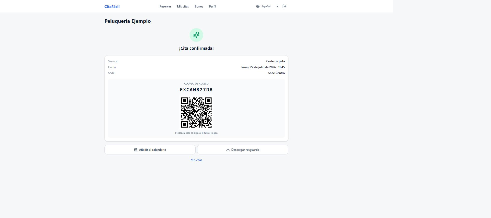

# Control de acceso físico

El cliente recibe un código y un QR al confirmar la cita, que es lo que se
presenta en la puerta:



Endpoint pensado para que lo llame directamente un torno, una puerta, un lector
de QR o una tablet en la entrada.

## El contrato

```http
POST /api/v1/organizations/<orgId>/access/validate
x-api-key: cf_abc12345_...
x-device-id: torno-entrada-1
Content-Type: application/json

{ "accessCode": "D8D7GCX3H1" }
```

```json
{
  "granted": true,
  "result": "granted",
  "reason": "Acceso concedido",
  "checkedInAt": "2026-07-27T08:58:12.004Z",
  "appointment": {
    "id": "...",
    "startsAt": "2026-07-27T09:00:00.000Z",
    "endsAt": "2026-07-27T10:00:00.000Z",
    "status": "checked_in",
    "serviceName": "Pista de pádel 3",
    "locationName": "Polideportivo Norte",
    "resourceName": "Pista 3",
    "customerName": "Lucía Pena",
    "partySize": 2
  }
}
```

**Siempre responde 200**, incluso cuando deniega el paso. Es deliberado: un
dispositivo empotrado no debería tener que distinguir entre "no tienes cita"
(403) y "el servidor se ha caído" (500). Con este contrato, cualquier respuesta
que no sea 200 es un problema de infraestructura y el dispositivo puede aplicar
su política de contingencia (por ejemplo, abrir en modo degradado o avisar).

## Formas de identificar la cita

| Campo | Cuándo se usa |
| --- | --- |
| `accessCode` | Lector de QR o código tecleado. Admite el código simple y el token firmado del QR. |
| `appointmentId` | El sistema externo ya sabe qué cita es. |
| `nif` | Lector de DNI. Busca la cita del usuario más cercana en el tiempo. |
| `userId` | Identificador interno. |

Campos opcionales:

```json
{
  "accessCode": "D8D7GCX3H1",
  "locationId": "...",     // exige que la cita sea de esta sede
  "resourceId": "...",     // exige que sea de este recurso (pista, sala)
  "at": "2026-07-27T09:05:00.000Z",  // momento de la comprobación, por defecto ahora
  "deviceId": "torno-1",
  "checkIn": true          // marca la llegada al conceder el acceso
}
```

## Veredictos

| `result` | Qué ha pasado |
| --- | --- |
| `granted` | Acceso concedido |
| `denied_not_found` | No hay ninguna cita con esos datos |
| `denied_wrong_time` | La cita no es a esta hora |
| `denied_wrong_location` | Es en otra sede o con otro recurso |
| `denied_status` | Cancelada, pendiente de aprobar o ya completada |
| `denied_already_used` | El código ya se usó y la organización exige uso único |
| `denied_unpaid` | El servicio exige pago y está pendiente |

## Ventana de tolerancia

Se configura por organización, en Ajustes → Control de acceso:

- `accessGraceBeforeMinutes` (15 por defecto): cuánto antes se admite la entrada.
- `accessGraceAfterMinutes` (15 por defecto): cuánto después.
- `accessSingleUse`: el código solo vale una vez, para eventos con entrada única.

Para un gimnasio con clases largas puede interesar ampliar el margen posterior;
para una consulta médica, reducirlo.

## El código QR

El QR de la cita no lleva el código a secas, sino `<código>.<firma>` con una
firma HMAC derivada de `APP_SECRET`. Así, quien vea un código impreso no puede
fabricar otros válidos probando, y el lector puede descartar los falsos sin
consultar la base de datos.

El endpoint acepta las dos formas: el token firmado (lo normal, viene del QR) y
el código simple (cuando alguien lo teclea desde el resguardo).

## Preparar la credencial

1. Panel → Integraciones → Claves de API → Nueva clave.
2. Nombre: por ejemplo "Torno entrada".
3. Permisos: `appointment:checkin` y `appointment:read`.
4. Opcional: lista de IP permitidas, si el dispositivo tiene IP fija.
5. Copia la clave; no se vuelve a mostrar.

## Ejemplos

### Torno con lector de QR

```bash
curl -s -X POST https://citas.ejemplo.es/api/v1/organizations/$ORG/access/validate \
  -H "x-api-key: $CLAVE" \
  -H "x-device-id: torno-1" \
  -H 'content-type: application/json' \
  -d "{\"accessCode\": \"$CODIGO_LEIDO\"}" \
  | jq -r '.granted'
```

### Lector de DNI en la puerta de una piscina

```json
{ "nif": "12345678Z", "locationId": "<sede>", "checkIn": true }
```

### Comprobación sin registrar la llegada

Útil para una pantalla informativa en recepción:

```json
{ "accessCode": "D8D7GCX3H1", "checkIn": false }
```

## Traza

Cada intento queda registrado en `access_logs` con el resultado, el dispositivo
y el código presentado. Se consulta desde el panel o con:

```
GET /organizations/:id/access/logs?from=...&to=...&locationId=...
```

Además se dispara el webhook `access.granted` o `access.denied`, por si hay que
encender una luz, abrir una barrera o avisar a alguien.
