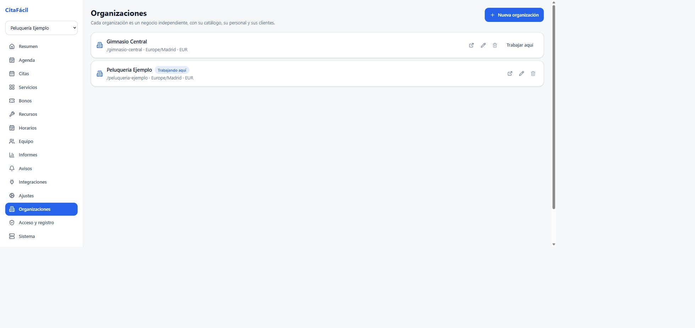
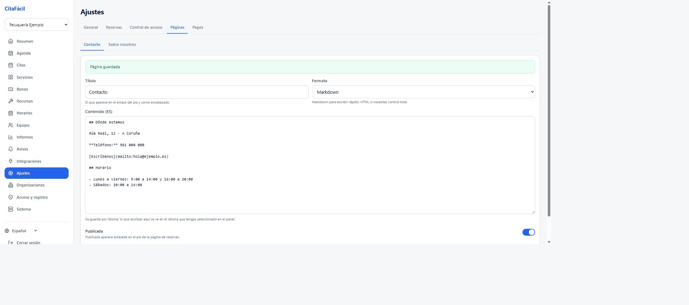
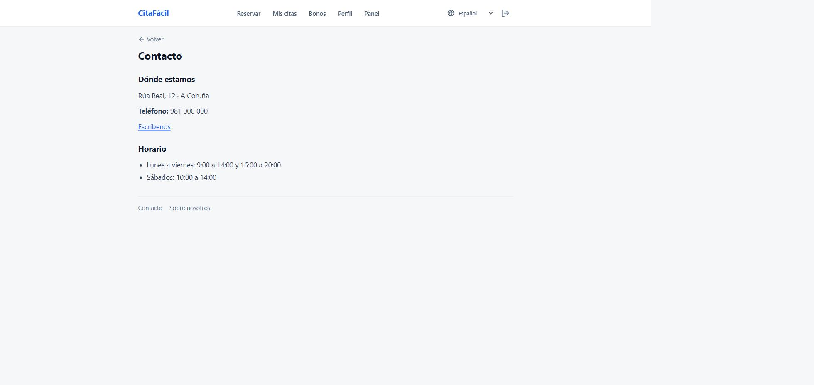

# Organizaciones

La aplicación es multi-tenant: una misma instalación puede alojar varios
negocios independientes. Una peluquería, un gimnasio y un polideportivo pueden
convivir en el mismo servidor sin verse entre ellos.

Cada organización tiene lo suyo y solo lo suyo:

| Propio de cada organización | Compartido por la instalación |
| --- | --- |
| Sedes, servicios, recursos y horarios | Cuentas de usuario |
| Citas, bonos, pagos e informes | Métodos de acceso y política de registro |
| Personal, permisos y plantillas de aviso | Copias de seguridad y ajustes del servidor |
| Página pública, marca y zona horaria | |

Que las cuentas sean de la instalación es deliberado: la misma persona puede ser
clienta de la peluquería y del gimnasio con un solo correo y una sola
contraseña, y su historial en cada negocio es independiente. Quien trabaja en un
negocio no ve nada del otro salvo que se le dé de alta también allí.



## Crear una organización

**Panel → Organizaciones → Nueva organización.** Solo aparece para el
administrador de la instalación (`superadmin`).

Hacen falta cuatro cosas: nombre, dirección pública, zona horaria y moneda. La
dirección pública se calcula a partir del nombre si se deja en blanco, y es la
que forma la URL de reservas: `https://tu-servidor/gimnasio-centro`.

Cada organización cuelga de la raíz, así que su dirección compite con las
pantallas de la aplicación (`/entrar`, `/admin`, `/mis-citas`...). Esos nombres
están reservados: si el que sale del nombre del negocio coincide con uno, se
usa el siguiente libre (`perfil` → `perfil-2`), y si se escribe a mano el
formulario lo rechaza.

Al crearla se hacen tres cosas automáticamente:

1. se crea una **sede inicial** con el mismo nombre, porque sin sede no se pueden
   recibir citas,
2. quien la crea queda como **propietario**,
3. el panel **pasa a trabajar en ella**, que es lo que se quiere hacer a
   continuación.

Después toca lo de siempre: servicios, horarios, recursos y equipo. Nada de eso
se hereda de otra organización.

Desde la consola también se puede, sin pasar por el panel:

```bash
curl -X POST https://tu-servidor/api/v1/organizations \
  -H "authorization: Bearer <token de superadmin>" \
  -H 'content-type: application/json' \
  -d '{"name":"Gimnasio Centro","timezone":"Europe/Madrid","locale":"es","currency":"EUR"}'
```

## Quién puede crear organizaciones

Por defecto, **solo el administrador de la instalación**. Es lo correcto para el
caso habitual: un servidor propio con uno o varios negocios conocidos. Si
cualquier cuenta registrada pudiera crear la suya, un cliente podría aparecer en
el portal público con un negocio inventado.

Para montar un servicio abierto, en el que cada quien se da de alta y crea su
negocio, se activa **Panel → Acceso y registro → Cualquiera puede crear su
propio negocio**. Entonces cualquier cuenta puede crear una organización y queda
como propietaria de ella.

## Cambiar de organización

Con más de una, el panel muestra un selector arriba del menú lateral. También se
puede cambiar desde Organizaciones con "Trabajar aquí". La elección se recuerda
entre sesiones.

El administrador de la instalación entra en todas sin necesidad de pertenecer a
ninguna. El resto del personal solo ve aquellas en las que tiene alta.

## Una cuenta en varias organizaciones

La cuenta es de la persona, no del negocio: el correo y la contraseña son los
mismos en toda la instalación y no hay que registrarse otra vez para el segundo
negocio.

- **Personal**: se le invita desde **Panel → Equipo** en cada organización. Si el
  correo ya tiene cuenta, la invitación añade el alta a la que ya tiene en vez de
  crear una cuenta nueva, y puede llevar un rol distinto en cada una (por
  ejemplo, propietaria de la peluquería y recepción del gimnasio).
- **Clientes**: no hace falta darlos de alta en ninguna parte. Reservar o recibir
  un bono ya los relaciona con esa organización, y cada negocio solo ve a los
  suyos: en el buscador de clientes del panel aparece quien tenga citas o bonos
  ahí, no todo el registro de la instalación.

Lo que no se comparte es el contenido: servicios, horarios, bonos, plantillas de
aviso y páginas son de cada organización.

## Dar de baja

Desde Organizaciones, con el icono de la papelera. Antes de confirmar se muestra
qué cuelga de esa organización: citas registradas, servicios y personal.

Es un **borrado lógico**: la organización deja de aparecer en el panel y en el
portal público, y su personal pierde el acceso, pero las citas, los bonos y los
pagos siguen en la base de datos. Un negocio que cierra no debería llevarse por
delante el histórico de gente que no tiene nada que ver con esa decisión.

Su dirección pública queda reservada: no se puede crear otra organización con el
mismo `slug`, para que un enlace o un QR antiguo no acabe en un negocio
distinto.

## Portal público con varios negocios

Con una sola organización, la portada redirige directamente a su página de
reservas. Cada negocio mantiene su color de marca, su logotipo y sus textos.

**Con varias, el directorio no es público.** Quien llega sin sesión viene por el
enlace o el QR de un negocio concreto, y su portada es la de ese negocio: al
entrar en `/` se le devuelve a él. Enseñarle la lista entera le saca del sitio
en el que creía estar y, de paso, cuenta a cualquiera qué otros negocios hay en
la instalación. Es la misma regla de privacidad entre organizaciones que rige en
la búsqueda de personas.

`GET /public/organizations` aplica lo mismo del lado del servidor: sin sesión
responde con la lista vacía en cuanto hay más de un negocio activo, y solo
devuelve el único cuando la instalación tiene uno, porque ahí no hay nada que
enumerar y la interfaz necesita saber a dónde saltar. Con sesión iniciada
devuelve todos, y la portada vuelve a hacer de directorio.

### El negocio en curso se recuerda

`Mis citas`, `Mis bonos` y `Perfil` son pantallas comunes que no llevan el
negocio en la dirección, así que el establecimiento por el que se entró se
guarda en `sessionStorage` (`web/src/stores/organization-context.ts`). De ahí
salen la marca de la cabecera, el tema y el negocio preseleccionado en los
bonos.

Por eso **"Reservar" lleva a la página del negocio en curso, no a `/`**: la
portada es de la instalación y pasar por ella borraba el contexto, así que ir a
"Mis citas", volver a "Reservar" y entrar otra vez en "Mis citas" dejaba al
cliente con el aspecto genérico. El contexto solo se olvida cuando la portada
enseña de verdad el directorio.

Como "Reservar" ya no lleva a la portada, quien reserva en más de un negocio
necesita otra salida, y es el **selector de establecimiento** de la cabecera
(`web/src/components/organization-switcher.tsx`). Se pinta al lado de la marca,
y casi nunca: hace falta sesión iniciada, porque el directorio no se sirve sin
ella, y más de un negocio activo. En la instalación normal, de uno solo, no se
ve nunca. Elegir uno lleva a su página de reservas, que es la dirección que
vuelve a fijar el contexto con su marca y su tema.

## Endpoints

| Método y ruta | Quién | Qué hace |
| --- | --- | --- |
| `GET /organizations` | con sesión | Las mías; todas si soy administrador de la instalación. |
| `POST /organizations` | superadmin, o cualquiera con el autoservicio activo | Crear. |
| `GET /organizations/:id` | `org:read` | Detalle. |
| `PATCH /organizations/:id` | `org:update` | Nombre, marca, zona horaria, ajustes. |
| `GET /organizations/:id/usage` | `org:read` | Qué cuelga de ella. |
| `DELETE /organizations/:id` | `org:delete` (propietario o superadmin) | Baja lógica. |

## Páginas de contacto y sobre nosotros

Cada organización puede publicar dos páginas de contenido propio:

- **Contacto**: dirección, teléfono, horarios, cómo llegar.
- **Sobre nosotros**: quiénes son, historia, equipo, lo que quieran contar.

Se editan en **Panel → Ajustes → Páginas**, en Markdown o en HTML, y se guardan
**por idioma**: la pestaña edita el idioma que se esté usando en el panel, así
que la misma página puede estar en español y en gallego con textos distintos.
Si falta un idioma se muestra el que haya, igual que con los servicios.

El interruptor **Publicada** es lo que las hace visibles: una página publicada
aparece enlazada en el pie de la página de reservas, en
`/<slug>/contacto` y `/<slug>/sobre-nosotros`. Sin publicar se
puede ir redactando sin que la vea nadie. Si no hay ninguna publicada, no
aparece pie.

El botón **Vista previa** enseña el resultado ya convertido, exactamente como lo
verá el cliente.

El editor guarda cada idioma por separado y tiene vista previa:



Y así queda publicada:



### Qué se puede escribir

El contenido se limpia siempre antes de pintarlo, tanto el Markdown convertido
como el HTML escrito a mano. Se admite lo que hace falta para una página de
contacto o de presentación: encabezados, párrafos, negritas, listas, citas,
código, enlaces, imágenes y tablas.

Se elimina todo lo demás, en particular `<script>`, los atributos `on*` y los
enlaces `javascript:`. No es desconfianza hacia el personal del negocio: el
token de sesión vive en la memoria del navegador, así que un script en la página
de un establecimiento se llevaría la sesión de cualquiera que la visitase,
incluido un cliente de otra organización de la misma instalación.

Tampoco se admiten `<iframe>`, así que un mapa incrustado no funcionará. Para
indicar dónde está el negocio, lo práctico es un enlace al mapa y la dirección
escrita, que además es lo que se puede copiar.

### Endpoints

| Método y ruta | Quién | Qué hace |
| --- | --- | --- |
| `GET /organizations/:id/pages` | `org:read` | Las dos páginas, con todos sus idiomas. |
| `PUT /organizations/:id/pages/:key` | `org:update` | Guardar una. |
| `GET /public/organizations/:slug/pages/:key` | público | El contenido ya resuelto al idioma. |

La respuesta de `GET /public/organizations/:slug` incluye además `pages` con la
clave y el título de las publicadas, que es lo que pinta el pie.
